Setup Ubuntu VM on VirtualBox
-----------------------------------

Before installing the SEED VM, please do the following:

- Install the free [Oracle® VM VirtualBox](https://www.virtualbox.org/) software first.
  - VirtualBox is a general-purpose full virtualizer for x86 hardware, targeted at server, desktop and embedded use. User Manual can be found [here](https://www.virtualbox.org/manual/).
  - Download the iso file `ubuntu-22.04.3-desktop-amd64.iso` from [Ubuntu](https://ubuntu.com/download/desktop/thank-you?version=22.04.3&architecture=amd64), This document shows how to build a virtual machine
using this image.

### Step 1: Create a New VM in VirtualBox

We need to use `New` to create a new virtual machine.

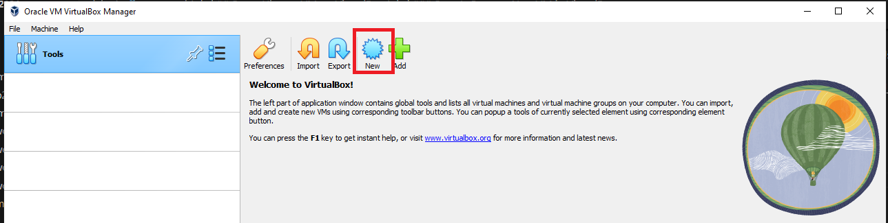
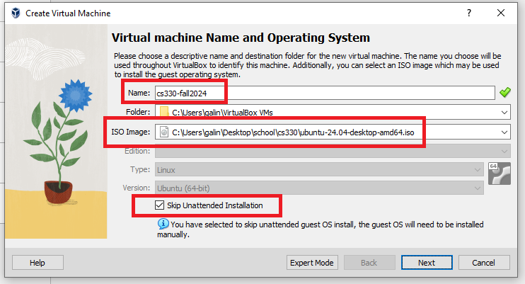
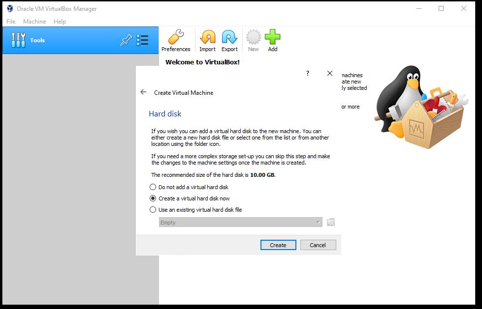
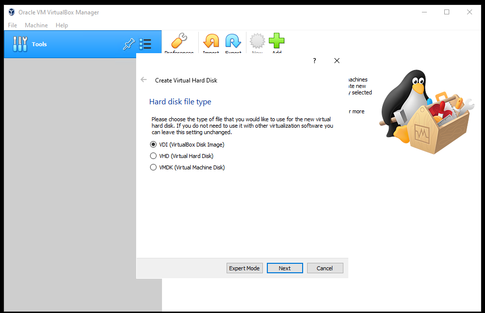
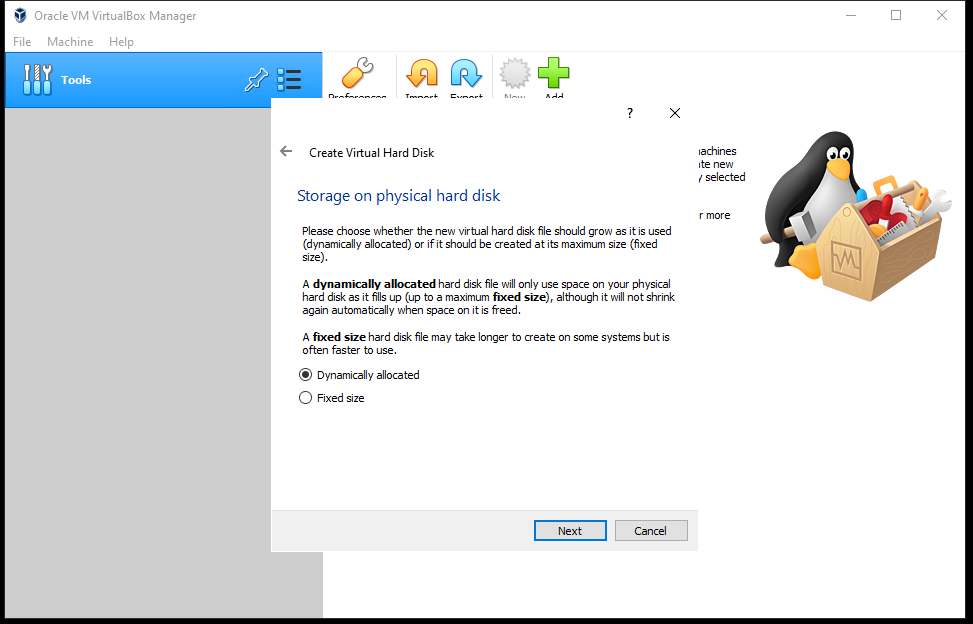
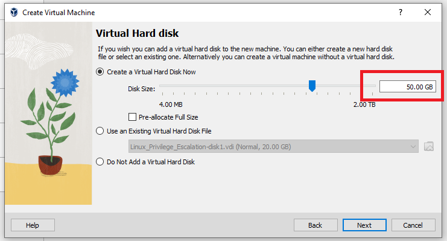

- We need to allocate dedicated memory for the VM. 4 GB should be sufficient. If your computer has more
RAM, you can increase accordingly. The more memory you give to the VM, the better the performance you will get.

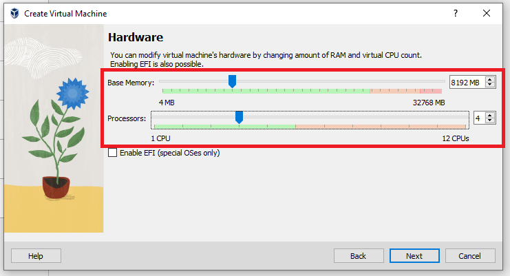

### Step 2: Configure the VM
After the previous step, your VM will be created, and you will see it on VirtualBox's VM panel. We need to do some further
configuration. Right-click the M, click the `Settings` option, and we will see the Settings window.

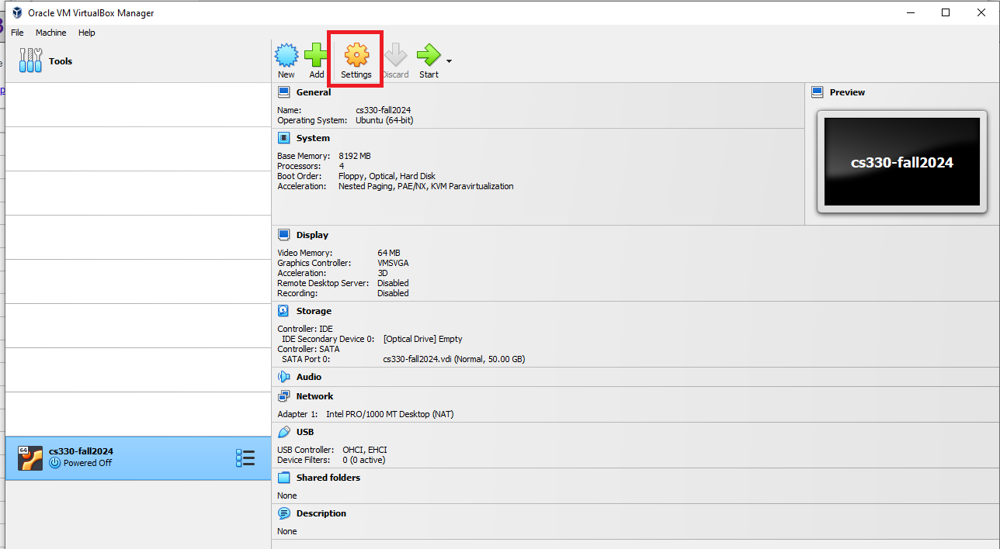

Go to the `System` category, and select the `Processor` tab. Assign number of CPUs to this VM if you prefer. Although may be sufficient,
if the performance seems to be an issue, increase the number.

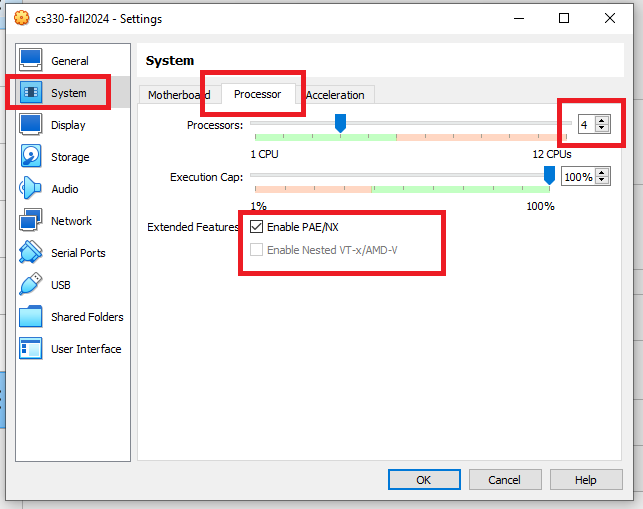

Go to the `Display` category, and select the `Screen` tab. If the display does not seem to work properly, try to increase the amount of video memory. In our testing, anything `32 MB` seems to be sufficient. Remember higher is better.
**Note 1**: Make sure to select `VMSVGA`, as choosing other graphic controllers
may lead to the crash of the VM.

**Note 2**: If your computer's screen resolution is too high, the VM may not be able
to match the high resolution. As results, your VM will be very small on your screen.
To make it bigger, adjust the `Scale Factor` in this setting.

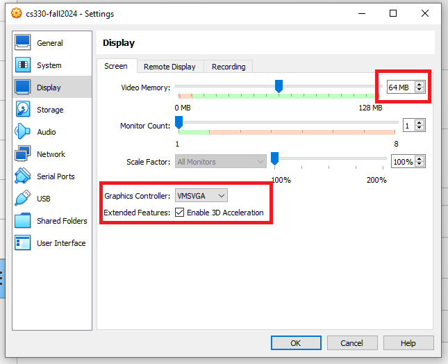

Now we can pick the iso we downloaded earlier. 

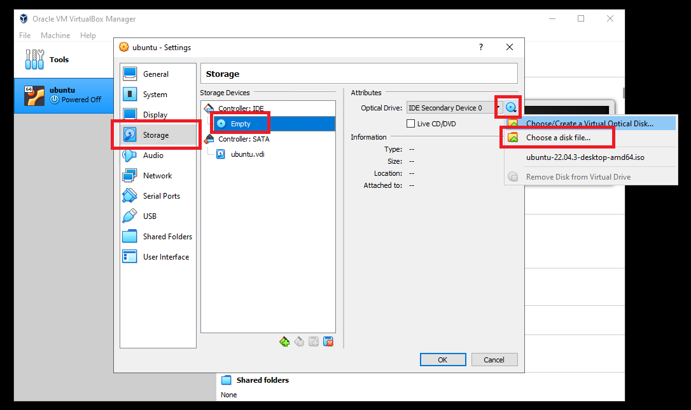

![mine]](images/vm-iso.png)

### Step 3: Install the VM
We can install Ubuntu by starting the newly created VM. 

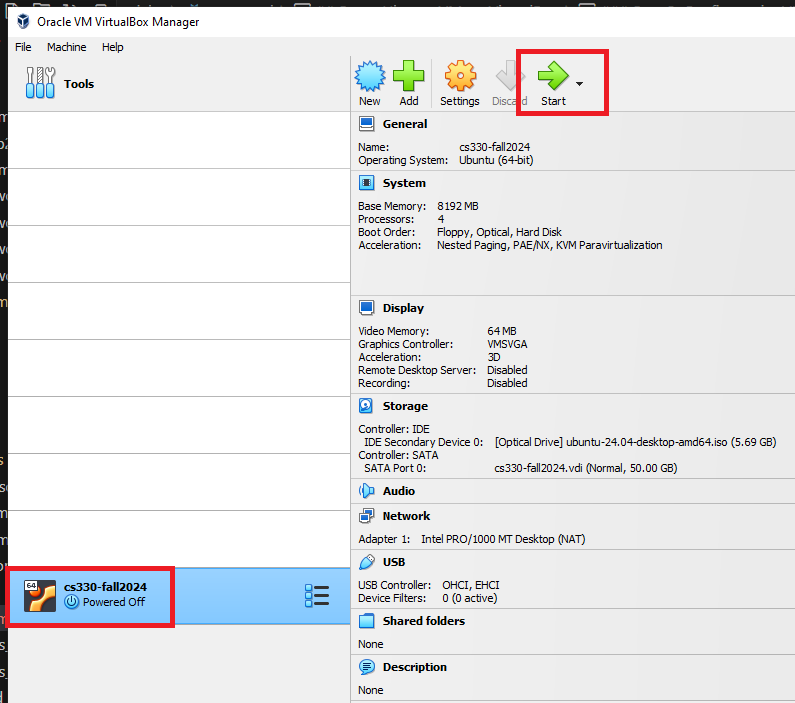
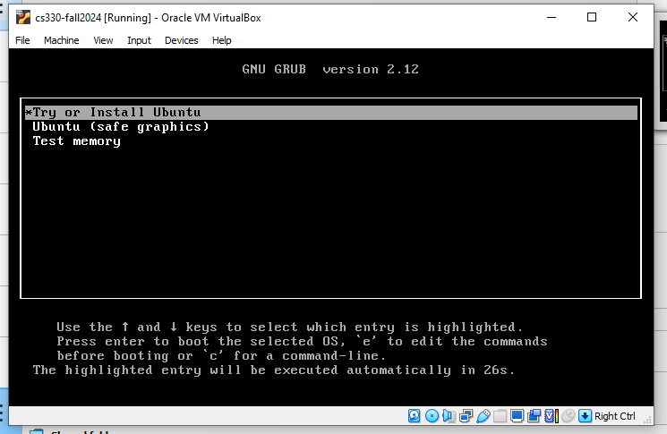
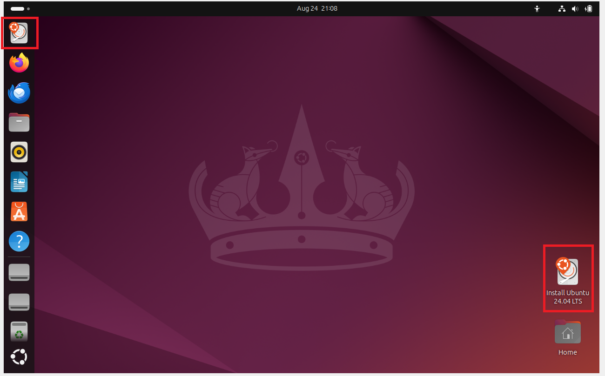

For installation type, pick `Erase disk and install Ubuntu`

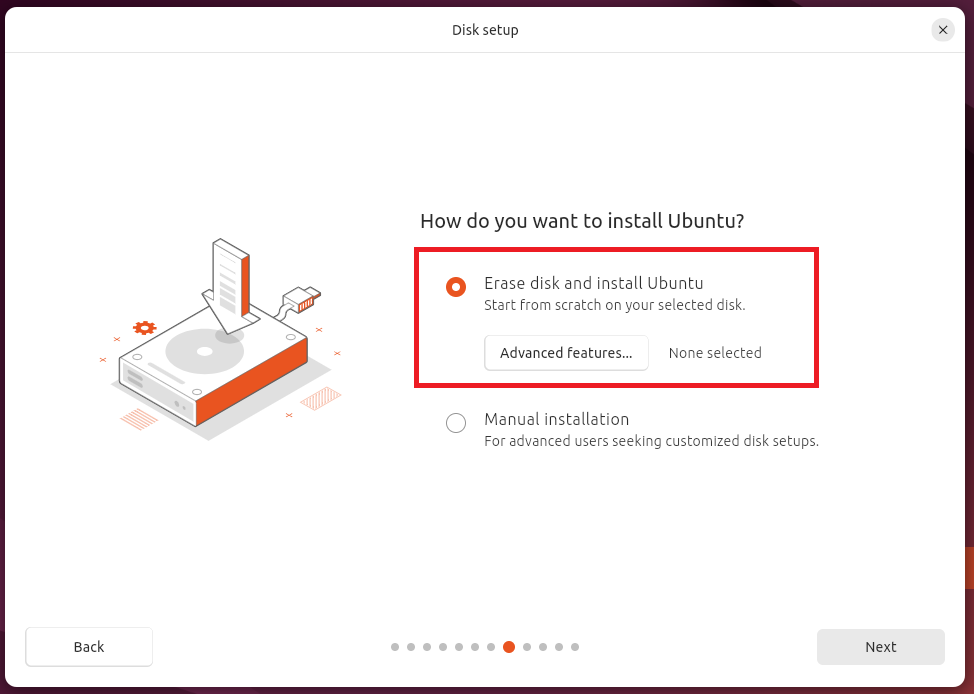

Continue through the normal installation process, remember your user name and password. I will use the following:
- User name: ```cs335```
- Password: ```cs335```
  


### Appendix A: Enable Copy and Paste

Go to the `General` category, and select the `Advanced` tab. Select `Bidirectional` for both items. The first item allows users to copy
and paste between the VM and the host computer The second item allows users to transfer files between the VM and the host computer using Drag'n Drop (this feature is not always reliable).


### Appendix B: Start the VM and Take Snapshot

We can now `Start` the VM. You can also use the `Take` button to take a snapshot of your VM. This way, if something goes wrong, you can roll back the state of your VM using the saved snapshots.

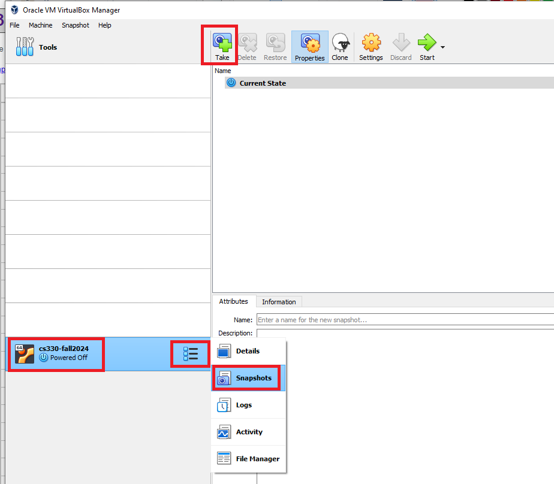

### Appendix C: Upgrade VM 
- ```sudo apt update``` - downloads package information from all configured sources.
- ```sudo apt upgrade``` - will upgrade all installed packages to their latest versions.
- ```sudo apt-get autoremove``` - deletes orphaned packages, or dependencies that remain installed after you have installed an application and then deleted it.
- ```sudo apt-get clean``` - removes all packages from the cache.

#### Install Editors
- Sublime: ```sudo snap install sublime-text --classic```  
- Visual Studio Code: ```sudo snap install --classic code```