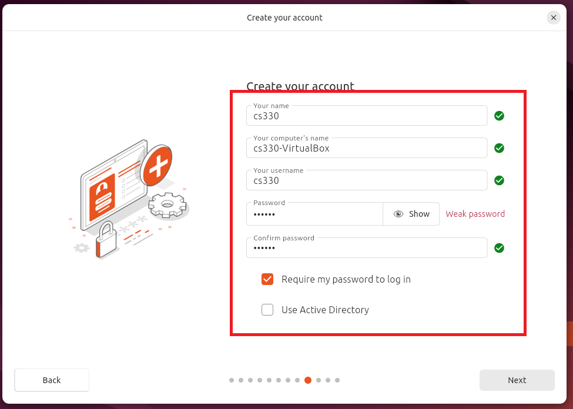
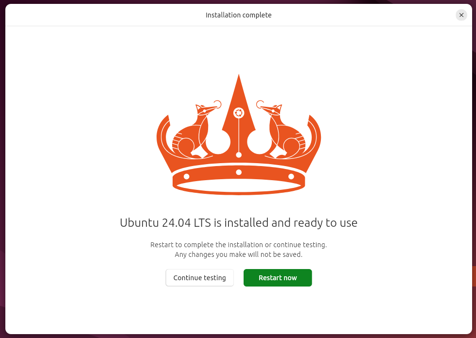
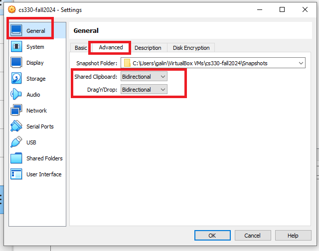

Setup Ubuntu VM on VirtualBox
-----------------------------------

Before installing the SEED VM, please do the following:

- Install the free [Oracle® VM VirtualBox](https://www.virtualbox.org/) software first.
  - VirtualBox is a general-purpose full virtualizer for x86 hardware, targeted at server, desktop and embedded use. User Manual can be found [here](https://www.virtualbox.org/manual/).
  - Download the iso file `ubuntu-24.04-desktop-amd64.iso` from [Ubuntu](https://ubuntu.com/download/desktop/thank-you?version=24.04&architecture=amd64&lts=true), This document shows how to build a virtual machine using this image. 
  
### Note:

Do not download the ISO to your `H:` drive; use the `C:` drive instead. There are known issues with running the VM from the `H:` drive.

### Step 1: Create a New VM in VirtualBox

We need to use the `New` option to create a new virtual machine.


<!-- 


 -->

- We need to allocate dedicated memory for the VM. 4 GB should be adequate for most needs. If your computer has additional RAM, you may increase this amount to enhance performance. More memory generally improves the VM's performance.


### Step 2: Configure the VM
After completing the previous step, your VM will be created and visible in the VirtualBox VM panel. We need to perform additional configuration. Right-click the VM, select the `Settings` option, and the Settings window will appear.


Go to the `System` category, and select the `Processor` tab. Assign number of CPUs to this VM if you prefer. Although may be sufficient,
if the performance seems to be an issue, increase the number.


Go to the `Display` category, and select the `Screen` tab. If the display does not seem to work properly, try to increase the amount of video memory. In our testing, anything `32 MB` seems to be sufficient. Remember higher is better.
**Note 1**: Make sure to select `VMSVGA`, as choosing other graphic controllers
may lead to the crash of the VM.

**Note 2**: If your computer's screen resolution is too high, the VM may not be able
to match the high resolution. As results, your VM will be very small on your screen.
To make it bigger, adjust the `Scale Factor` in this setting.


Here is a summary of the selected options. 


### Step 3: Install the VM
We can install Ubuntu by starting the newly created VM. 


Click on the Install Ubuntu 24.04 LTS shortcut. Proceed through the installation wizard If you have any questions, don’t hesitate to ask.


 I choose to install recommended proprietary software.

 

For installation type, pick `Erase disk and install Ubuntu`


Continue with the standard installation process and be sure to remember your username and password. I will use the following credentials:
- User name: ```ubuntu```
- Password: ```ubuntu```
  


Congratulation, your VM is ready.



### Appendix A: Enable Copy and Paste

Navigate to the `General` category and select the `Advanced` tab. Set both options to `Bidirectional`. The first option enables copying and pasting between the VM and the host computer, while the second allows file transfers using drag-and-drop (note that this feature may not always be reliable).



### Appendix B: Start the VM and Take Snapshot

We can now `Start` the VM. You can also use the `Take` button to take a snapshot of your VM. This way, if something goes wrong, you can roll back the state of your VM using the saved snapshots.


### Appendix C: Upgrade VM 
- ```sudo apt update``` - downloads package information from all configured sources.
- ```sudo apt upgrade``` - will upgrade all installed packages to their latest versions.
- ```sudo apt-get autoremove``` - deletes orphaned packages, or dependencies that remain installed after you have installed an application and then deleted it.
- ```sudo apt-get clean``` - removes all packages from the cache.

#### Install Editors 
- Visual Studio Code: ```sudo snap install --classic code```
- Sublime: ```sudo snap install sublime-text --classic``` 